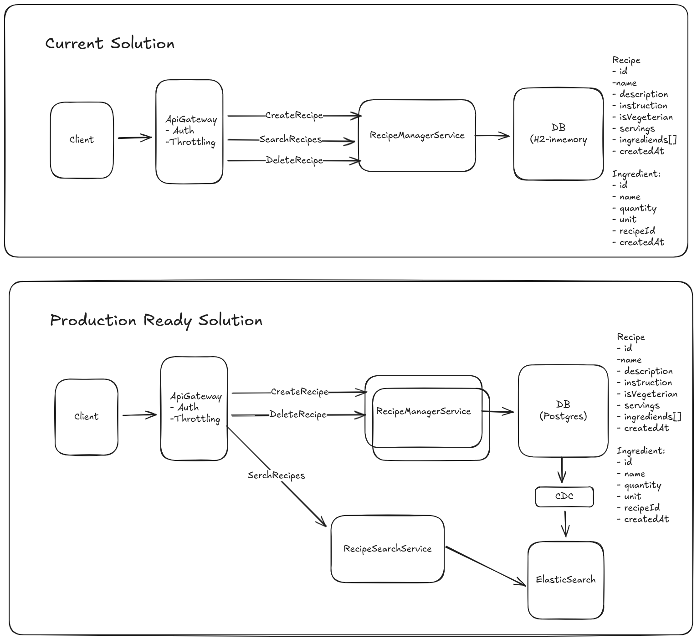

# Recipe Manager Backend

This project is a simple microservice for managing recipes, built with Spring Boot. 
It provides REST endpoints to create, search, and delete recipes.

## Features

- **Add Recipes**: Create new recipes with details like name, description, vegetarian status, servings, instructions, and a list of ingredients.
- **Search Recipes**: A powerful search endpoint to filter recipes based on various criteria like vegetarian status, number of servings, included or excluded ingredients, and keywords in the instructions.
- **Delete Recipes**: Remove recipes from the system.
- **In-Memory Database**: Uses an H2 in-memory database for simplicity and ease of use.
- **Simple UI**: Includes a basic `index.html` to interact with the API directly from the browser.

## Getting Started

### Prerequisites

- Java 21
- Maven
- Docker

### Spring Boot version 3.5.9 - version 4.0.1 has conflict issue with swagger.core jackson version

### Running the Application

1.  **Clone the repository.**
2.  **Run the application** 
    ```sh
    docker-compose up
    ```
3.  **Access the application**:
    - The API will be available at `http://localhost:8080`.
    - The simple web UI will be available at `http://localhost:8080/index.html`.

## API Endpoints

| Endpoint | Method | Description | Request Body Example | Response Body Example |
| :--- | :--- | :--- | :--- | :--- |
| `/recipes` | `POST` | Creates a new recipe. | <pre><code>{<br>  "name": "Vegetable Stir Fry",<br>  "description": "Quick and healthy stir fry",<br>  "isVegetarian": true,<br>  "servings": 2,<br>  "instructions": "1. Heat oil in pan. 2. Add vegetables. 3. Stir fry for 10 minutes.",<br>  "ingredients": [<br>    {<br>      "name": "Broccoli",<br>      "quantity": 200,<br>      "unit": "gr"<br>    }<br>  ]<br>}</code></pre> | <pre><code>{<br>  "id": 101,<br>  "name": "Vegetable Stir Fry",<br>  "description": "Quick and healthy stir fry",<br>  "isVegetarian": true,<br>  "servings": 2,<br>  "instructions": "1. Heat oil in pan. 2. Add vegetables. 3. Stir fry for 10 minutes.",<br>  "ingredients": [<br>    {<br>      "name": "Broccoli",<br>      "quantity": 200,<br>      "unit": "gr"<br>    }<br>  ]<br>}</code></pre> |
| `/recipes/search` | `POST` | Searches for recipes with various filters. | <pre><code>{<br>  "isVegetarian": true,<br>  "servings": 4,<br>  "includeIngredients": ["mushrooms"],<br>  "instruction": "oven"<br>}</code></pre> | <pre><code>{<br>  "data": [<br>    {<br>      "id": 6,<br>      "name": "Mushroom Risotto",<br>      "description": "A creamy and savory Italian rice dish.",<br>      "isVegetarian": true,<br>      "servings": 4,<br>      "instructions": "1. Sauté mushrooms...",<br>      "ingredients": [<br>        {<br>          "name": "Arborio Rice",<br>          "quantity": 300,<br>          "unit": "gr"<br>        }<br>      ]<br>    }<br>  ],<br>  "pagination": {<br>    "page": 1,<br>    "pageSize": 20,<br>    "totalItems": 1<br>  }<br>}</code></pre> |
| `/recipes/{id}` | `DELETE` | Deletes a recipe by its unique ID. | (No request body) | (No response body on success - `204 No Content`) |

## To-do and Considerations

This project was built with production-readiness in mind, but some features were simplified for the scope of this assignment. Here are considerations for future development:

-   **Database**: Currently using an H2 in-memory database for simplicity. For a production environment, this should be replaced with a persistent database like PostgreSQL or MySQL.
-   **Security**: The API is currently open. For production, it would need authentication and authorization, likely using Spring Security with JWT or OAuth2.
-   **Error Handling**: While basic error handling is in place, it could be enhanced with a more standardized error response format and more specific error codes.
-   **Testing**: The project includes a good foundation of unit, integration, and MockMvc tests. This should be expanded to cover more edge cases and failure scenarios.
-   **API Documentation**: The API is defined in an OpenAPI 3.0 specification (`recipe-manager.yaml`). For easier use, this could be integrated with Swagger UI.
-   **Configuration**: Application properties are currently in the main properties file. For different environments (dev, staging, prod), these should be externalized into profile-specific configuration files.
-   **Data Migration**: For a production database, a schema migration tool like Flyway or Liquibase would be essential to manage database changes in a controlled and versioned way.
-   **Performance**: For high-traffic scenarios, caching could be introduced for frequently requested data, such as the results of popular searches.

## System Design

A simple system design was considered for this application


